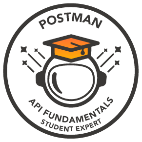

  

<h1 ></h1>

  

  
<table align="center">
  <tr>
    <th>Languages</th>
    <th>Frontend</th>
    <th>Backend / Frameworks</th>
  </tr>
  

  

  <tr>
    <td align="center">
      
    </td>
    <td align="center">
      
    </td>
    <td align="center">
      
       
      
    </td>
  </tr>
</table>

 

<table align="center">
  <tr>
    <th>Database</th>
    <th>DevOps / Deployment</th>
    <th>API / Tools</th>
  </tr>
  <tr>
    <td align="center">
      
    </td>
    <td align="center">
      
      
  
    </td>
    <td align="center">
      
      
    </td>
  </tr>
</table>

 

<table align="center">
  <tr>
    <th>Platforms</th>
  </tr>
  <tr>
    <td align="center">
      
      
        
    </td>
  </tr>
</table>
  
 

  

     
  
  
  
  
  
  
    

 

<h2 align="center" style="color:#00FF00;">📊 Activity Graph</h2>

  

  
<h2 align="center" style="color:#00FF00;">🌐 Let's Connect</h2>

  <!-- LinkedIn -->
  
  &nbsp;&nbsp;&nbsp;&nbsp;

  <!-- Twitter / X -->
  
  &nbsp;&nbsp;&nbsp;&nbsp;

  <!-- Gmail -->
  

  <b>“Main rahoon ya na rahoon”</b>

  
  
  

