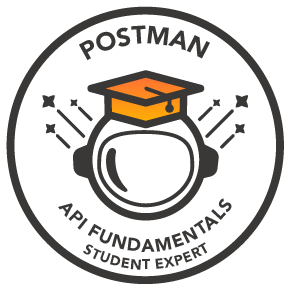

<p align="center">
  
</p>
<h1 ></h1>
<p align="center">
  
</p>
<br></br>
<table align="center">
  <tr>
    <th>Languages</th>
    <th>Frontend</th>
    <th>Backend / Frameworks</th>
  </tr>
</p>
  <tr>
    <td align="center">
      
    </td>
    <td align="center">
      
    </td>
    <td align="center">
      
       
       
      <br/>
     </td>
  </tr>
</table>

<br/>

<table align="center">
  <tr>
    <th>Database</th>
    <th>DevOps / Deployment</th>
    <th>API / Tools</th>
  </tr>
  <tr>
    <td align="center">
      
              <br/>
    </td>
    <td align="center">
      
      
 <br/>
    </td>
    <td align="center">
      
      
      <br></br>
        
        
        
    </td>
  </tr>
</table>

<br/>

<table align="center">
  <tr>
    <th>Platforms</th>
  </tr>
  <tr>
    <td align="center">
      
      
        
      
    </td>
  </tr>
</table>

<table align="center">
  <tr>
    <th>Best Buddies</th>
  </tr>

  <tr>
    <!-- AI TOOLS -->
    <td align="center"> 
            <!-- Lovable -->
      
<!-- Claude (Anthropic official orange #D97706 approx) -->
      
    
   
    </td>
     </tr>
</table>

<br>
<div align="center">

<table align="center">
  <tr>
    <td align="center">
      <a href="https://badges.parchment.com/public/assertions/D8xGrEtBTnmn42zzr0FO3g?identity__email=puskarnath110%40gmail.com" target="_blank">
        
      </a>
      
      
      
      
      
    </td>
  </tr>
</table>
</div>
<br>


```text
 Morning                1788 commits        ███████░░░░░░░░░░░░░░░░░░   27.76 % 
 Daytime                1465 commits        ██████░░░░░░░░░░░░░░░░░░░   22.74 % 
 Evening                2863 commits        ███████████░░░░░░░░░░░░░░   44.44 % 
 Night                  326 commits         ███░░░░░░░░░░░░░░░░░░░░░░   05.06 % 
```

```text
🕑︎ Time Zone: Asia/Kolkata

Programming Languages: 
Markdown                 1 hr 13 mins        ████████░░░░░░░░░░░░░░░░░   30.72 % 
Java                     46 mins             █████░░░░░░░░░░░░░░░░░░░░   19.30 % 
Python                   41 mins             ████░░░░░░░░░░░░░░░░░░░░░   17.42 % 
JavaScript               21 mins             ██░░░░░░░░░░░░░░░░░░░░░░░   09.12 % 
HTML                     12 mins             █░░░░░░░░░░░░░░░░░░░░░░░░   05.13 % 

Editors: 
VS Code                  2 hrs 25 mins       █████████████████████████   100.00 % 

```

**AI Coding This Week** 

```text
⏱ AI Coding Time: 1 hrs 54 mins (52.45%)

3,254 lines written by AI, 235 lines written by hand (92.24% AI-written)

569,125 Input Tokens, 144,258 Output Tokens

16 AI Sessions, 28 AI Prompts

```
<!--END_SECTION:waka-->

<p align="center">
  <!-- LinkedIn -->
  <a href="https://www.linkedin.com/in/puskar-nath-a44958314/" target="_blank">
    
  </a>
  &nbsp;&nbsp;&nbsp;&nbsp;

  <!-- Twitter / X -->
  <a href="https://x.com/Last_Safar" target="_blank">
    
  </a>
  &nbsp;&nbsp;&nbsp;&nbsp;

  <!-- Gmail -->
  <a href="mailto:puskarofficial404@gmail.com">
    
  </a>
</p>

<p align="center">
  <a href="https://www.buymeacoffee.com/puskar">
    
  </a>
</p>

<p align="center" style="color:#00FF00;">
  <b>“Main rahoon ya na rahoon”</b>
</p>
